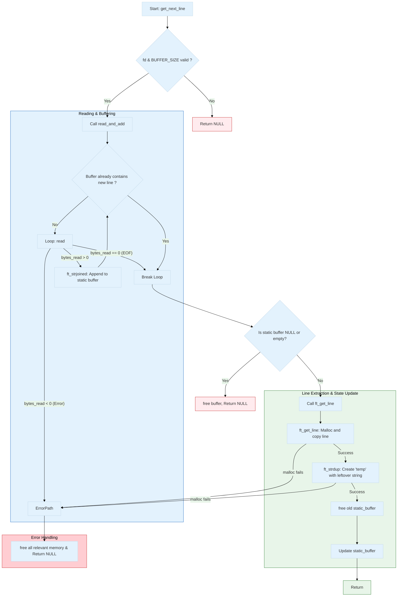

# 📜 get_next_line | 42 School Project

### My journey into the wonderful world of static variables and potential memory leaks. 😀


> *"A foundational project focused on mastering static variables and buffer management to read from a file descriptor."*

---

## 🎯 Project Overview

Welcome to my implementation of `get_next_line`, a key project in the 42 curriculum. The primary objective is to create a C function that reads content from a file descriptor, one line at a time. This project is a practical exercise in managing memory and handling low-level file input/output.

##  🚀 Getting Started

#### 1. Clone the repository:
```bash
get clone https://github.com/MEHDIJAD/42cursus-get_next_line.git
```

#### 2. Navigate to the project directory:

```bash
cd 42Cursus-get_next_line
```
#### 3. Compile with your project:

```bash
gcc -Wall -Wextra -Werror -D BUFFER_SIZE=42 your_program.c get_next_line.c get_next_line_utils.c
```

----


## 🤖 Code Flow 



## ⚙️ Under the Hood: How get_next_line Works with the OS

### Who Does What

1. **🐧 The Operating System**

- Tracks the file offset (a cursor) for each file descriptor. It knows 	where the next physical read from the disk should happen. This is updated automatically every time you call read().

2. **🧑‍💻 My get_next_line**

- Tracks the leftover buffer (static char *str_buf). It stores data that has been read from the OS but not yet returned to the user as a complete line.

## 👨‍💻 Author

- 42 Intra: [eel-garo](https://profile.intra.42.fr/users/eel-garo)
- GitHub: [MEHDIJAD](https://github.com/MAHDIJAD)

