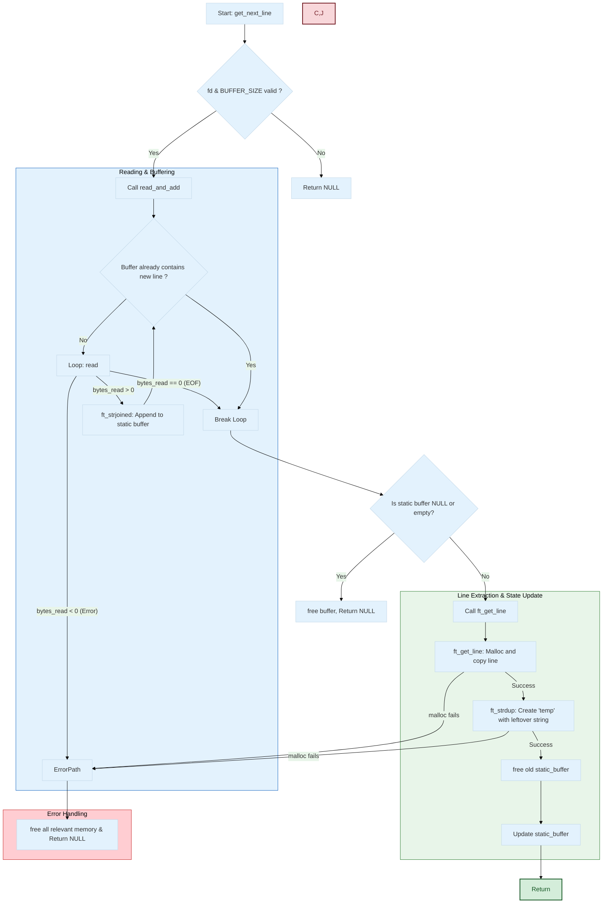

# 📜 get_next_line | 42 School Project

### My journey into the wonderful world of static variables and potential memory leaks. 😀


> *"A foundational project focused on mastering static variables and buffer management to read from a file descriptor."*

---

## 🎯 Project Overview

Welcome to my implementation of `get_next_line`, a key project in the 42 curriculum. The primary objective is to create a C function that reads content from a file descriptor, one line at a time. This project is a practical exercise in managing memory and handling low-level file input/output.

##  🚀 Getting Started

#### 1. Clone the repository:
```bash
get clone https://github.com/MEHDIJAD/42cursus-get_next_line.git
```

#### 2. Navigate to the project directory:
```bash
cd 42Cursus-get_next_line
```
#### 3. Compile with your project:
```bash
gcc -Wall -Wextra -Werror -D BUFFER_SIZE=42 your_program.c get_next_line.c get_next_line_utils.c
```

----

## 💡 Implementation Details


## Code Flow 



